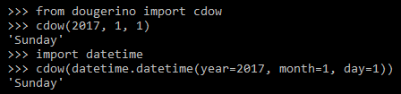

# dougerino
Library of functions for common Python development tasks.

* [bytecount](#bytecount)
* [cdow](#cdow)
* [ChangeDirectory](#ChangeDirectory)
* [cls](#cls)
* [column_values](#column_values)
* [csv2dict](#csv2dict)
* [csv2list](#csv2list)
* [days_since](#days_since)
* [dicts2csv](#dicts2csv)
* [dicts2json](#dicts2json)
* [filesize](#filesize)
* [hashkey](#hashkey)
* [json2csv](#json2csv)
* [list_projection](#list_projection)
* [percent](#percent)
* [printlines](#printlines)
* [progressbar](#progressbar)
* [setting](#setting)
* [time_stamp](#time_stamp)
* [yeardiff](#yeardiff)

## bytecount

Function for concise display of approximate numeric values. Examples:

```
bytecount(123) -----------> 123 bytes
bytecount(5280) ----------> 5.2 KB
bytecount(12345678) ------> 11.8 MB
bytecount(12345678901) ---> 11.5 GB
```

## cdow

Returns a weekday name, arguments can be a date, datetime, or year/month/day.



## ChangeDirectory

This class is a context manager for changing to another directory and then reverting to the prior working directory when done.
```python
from dougerino import ChangeDirectory
with ChangeDirectory(folder):
    pass # code that should run in folder
# returns to previous working directory when done
```
## cls

///

## column_values

///

## csv2dict

///

## csv2list

///

## days_since

///

## dicts2csv

///

## dicts2json

///

## filesize

///

## hashkey

///

## json2csv

///

## list_projection

///

## percent
    
///

## printlines

///

## progressbar

///

```python
print('Example of using progressbar() function ...')
progressbar.lastdisplay = ''
for progress_value in range(100):
    progressbar(progress_value/100, bar_length=80, done_char='#')
    time.sleep(.02)
progressbar(1, bar_length=80, done_char='#') # 1 = 100% finished
```

## setting

///

## time_stamp

///

## yeardiff

///
