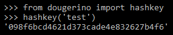
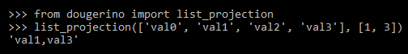
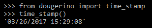
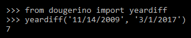

# dougerino
Library of functions for common Python development tasks.

  

# Installation

To install and use the latest stable version of dougerino, install from this GitHub repo's master branch with this command:

```
pip install git+https://github.com/dmahugh/dougerino.git@master
```

Note that dougerino library requires the ```requests``` package as well as several Azure packages. See ///requirements.txt and ///setup.py for more information.

# Contributing

Dougerino is a work in progress — pull requests, feature requests and issues welcome. I've implemented functionality as I need it for various projects, but I'm interested in knowing what other types of functionality may be useful to others. Please log an ///issue if you have a suggestion. Thanks!

# License / Copyright

Dougerino is licensed under the [MIT License](https://github.com/dmahugh/dougerino/blob/master/LICENSE).

Copyright © 2015-2017 by Doug Mahugh. All Rights Reserved.

# Usage

Follow these links for a description or example of the usage of each function or class:

* [bytecount](#bytecount)
* [cdow](#cdow)
* [ChangeDirectory](#ChangeDirectory)
* [cls](#cls)
* [csv_count](#csv_count)
* [csv2dict](#csv2dict)
* [csv2json](#csv2json)
* [csv2list](#csv2list)
* [days_since](#days_since)
* [dicts2csv](#dicts2csv)
* [dicts2json](#dicts2json)
* [filesize](#filesize)
* [github_allpages](#github_allpages)
* [github_pagination](#github_pagination)
* [github_rest_api](#github_rest_api)
* [hashkey](#hashkey)
* [json2csv](#json2csv)
* [list_projection](#list_projection)
* [percent](#percent)
* [printlines](#printlines)
* [progressbar](#progressbar)
* [setting](#setting)
* [time_stamp](#time_stamp)
* [yeardiff](#yeardiff)

## bytecount

Function for concise display of approximate numeric values. Examples:

```
bytecount(123) -----------> 123 bytes
bytecount(5280) ----------> 5.2 KB
bytecount(12345678) ------> 11.8 MB
bytecount(12345678901) ---> 11.5 GB
```

## cdow

Returns a weekday name, arguments can be a date, datetime, or year/month/day.


## ChangeDirectory

This class is a context manager for changing to another directory and then reverting to the prior working directory when done.
```python
from dougerino import ChangeDirectory
with ChangeDirectory(folder):
    pass # code that should run in folder
# returns to previous working directory when done
```
## cls

Cross-platform clear-screen function for console apps.

## csv_count

Function arguments: csvfile, column

Counts the occurences of each distinct value in a specified column of a CSV file.
Returns a dictionary whose keys are the distinct values, and the value of each
dictionary entry is the count for that distinct value.

## csv2dict

Function arguments: filename, key_column, val_column, lower, header

Returns a dictionary with one entry for each row in a specified CSV file,
using the specified columns for the dictionary's key/value pairs.
Optional arguments for whether to make all keys lower-case (default=True)
and whether the CSV file has a header row (default=True).

## csv2json

Arguments: csvdata, header

Returns a JSON object (list of dictionaries) that contains all of the data from
the contents of a CSV file (passed as a string). Optional parameter to indicate
whether the CSV data includes a header row (default=True). If no header row,
the dictionaries have keys named field0, field1, etc.

## csv2list

Arguments: filename, column, lower, header, dedupe

Returns a specified column number (0-based) of a CSV file as a list. Optional
parameters for whether to return values as lower-case (default=True), whether
the CSV file has a header (default=True), and whether to eliminate duplicate
entries in the list (default=True).

## days_since

Return number of days that have passed since a specified date. Date is passed
as a string, YYYY-MM-DD format.

## dicts2csv

Write a specified list of dictionaries (as returned by json.loads()) to a specified
CSV file.

## dicts2json

Write a specified list of dictionaries (as returned by json.loads()) to a specified
JSON file.

## filesize

Returns byte size for a specified filename. (Wrapper around os.stat().st_size.)

## github_allpages

Retrieves data from the GitHub V3 REST API, and handles pagination so that all
instances of the requested entity type are returned in a single list of dictionaries.

## github_pagination

This function parses the 'link' HTTP header returned by the GitHub V3 REST API,
and returns a dictionary that can be used to navigate paged results. For example, here
is the content of a link header:

```
<https://api.github.com/organizations/6154722/repos?page=2>; rel="next", <https://api.github.com/organizations/6154722/repos?page=98>; rel="last"
```

And here is the dictionary returned by github_pagination() for that header:

```JSON
{
    'firstpage': 0,
    'firstURL': None,
    'lastpage': '98',
    'lastURL': 'https://api.github.com/organizations/6154722/repos?page=98',
    'prevpage': 0,
    'prevURL': None,
    'nextpage': '2',
    'nextURL': 'https://api.github.com/organizations/6154722/repos?page=2',
}
```

## github_rest_api

Wrapper function for querying the GitHub V3 REST APIs.

## hashkey



## json2csv

Arguments: jsondata, header (default=True)

Converts a JSON document (string) to a CSV representation (string).

Note that this function takes a *string* version of the JSON data, because
it is commonly used with data read from a file. E.g., ```open('filename.json').read()```.

## list_projection

Returns a comma-delimited string containing specified values from a list.



## percent
    
Returns percentage for specified value and total.

## printlines

Arguments: filename, numlines (default=1)

Prints to the console the specified number of lines of a text file. Commonly
used for quickly peeking at the beginning of a very large CSV file.

## progressbar

Display on the console a text-based progress bar showing completion status.

```python
print('Example of using progressbar() function ...')
progressbar.lastdisplay = ''
for progress_value in range(100):
    progressbar(progress_value/100, bar_length=80, done_char='#')
    time.sleep(.02)
progressbar(1, bar_length=80, done_char='#') # 1 = 100% finished
```

## setting

Arguments: topic, section, key

Confidential information such as access tokens and passwords is stored in
topic-based INI files in the ```..\_private``` folder, to avoid any risk
of committing this information to GitHub. This function is used to retrieve
those values. Topic is the name of the INI file (not including the .ini
extension), section refers to a section within the INI file, and key is
the name of the desired value within the section.

## time_stamp

Returns a timestamp string for a specified file, or for the current
date/time if no file specified.



## yeardiff

Arguments: fromdate, todate

Returns the difference in years between two dates. Arguments can be
date/datetime objects or strings in month/day/year format.


